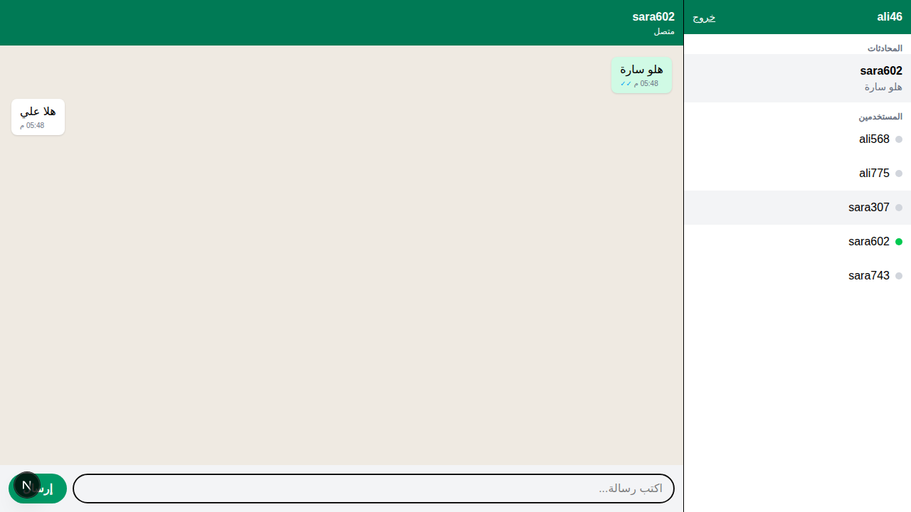

# شات — Django + Next.js

تطبيق محادثات فوري ("وَصل"): محادثات ثنائية ومجموعات، رسائل مباشرة (WebSocket)، صور وفيديو ورسائل صوتية وملفات،
مشاركة الموقع (ومباشر)، رد وتعديل وحذف، ✓ / ✓✓ / ✓✓ أزرق، الحالات (24 ساعة)، مكالمات صوت وفيديو (WebRTC)،
إشعارات Push، ملف شخصي، الرسائل المحفوظة، ونموذجين للشكل (زجاجي وداكن).



## التشغيل

**Backend** (بورت 8000):
```bash
python3 -m venv .venv && source .venv/bin/activate
cd backend
pip install -r requirements.txt
python manage.py migrate
daphne -p 8000 config.asgi:application
```

**Frontend** (بورت 3000):
```bash
cd frontend
npm install
npm run dev
```
افتح http://localhost:3000 بمتصفحين (واحد منهم Incognito) وسجل مستخدمين وجرب.

**بعد كل `git pull`** (إذا انضافت مكتبات أو جداول):
```bash
cd backend && pip install -r requirements.txt && python manage.py migrate
cd ../frontend && npm install
```

## الاختبارات
- **اختبارات الخادم:** `cd backend && python manage.py test`
- **اختبارات المتصفح (Playwright):**
  - خمس عشرة حزمة في `frontend/tests/e2e/` تجرّب التطبيق كما يستعمله الناس: الدخول، والمحادثات، والوسائط، والمكالمات، والإعدادات، والمراحل (أ) و(ب) و(ج)،
    و`pd`: الإرسال الفوري على إنترنت ضعيف، والفيديو ومشاركة الشاشة مع محاكاة سفاري، والإضافة إلى المكالمة، والسحب للخلف،
    و`pe`: المكالمة مثل Google Meet (الدردشة، والتفاعلات، ورفع اليد، والكتم، ومن يتكلم، وتبديل الكاميرا، وملء الشاشة، والتكبير)،
    و`pf`: مكالمة أُغلق فيها التطبيق دون «إنهاء» لا تمنع الاتصال بعدها،
    و`pg`: المكالمة في الظروف الصعبة (الإلغاء أثناء سؤال الإذن، ورسالة تعارف ضائعة، والاتصال ببعض معاً، وسبب الفشل)،
    و`ph`: لوحة الإدارة داخل التطبيق (طلبات الأدوار، ونسيت كلمة المرور، والبلاغات).
  - تحتاج الخادم على 8000 والواجهة على 3000 (`npm run build && npm start`). ثم:
    ```bash
    cd frontend
    npx playwright install chromium   # مرة واحدة
    npm run test:e2e                  # كل الحزم
    npm run test:e2e -- pa pc         # حزم بعينها
    ```
  - الصور الملتقطة تُحفظ في `frontend/tests/e2e/.out/ui/`.
- **الفحص التلقائي (GitHub Actions):**
  - يعمل مع كل push وكل Pull Request (`.github/workflows/ci.yml`).
  - يشغّل: اختبارات الخادم، وTypeScript، وESLint، والترجمة، والبناء، ثم اختبارات المتصفح.
- **اختبار الضغط:** `loadtest/run.py`، والنتائج في `loadtest/results/`، وطريقة التشغيل في `docs/DEPLOY.md`.

## الخط
- التطبيق يحمل خطه معه: **IBM Plex Sans Arabic** (من الحزمة `@fontsource/ibm-plex-sans-arabic`، وأوزانه 400 و500 و600 و700).
- يظهر الخط نفسه، الواضح والمستقيم، على كل جهاز، بدل خط النظام الذي قد يكون نسخياً مزخرفاً على بعض هواتف أندرويد.

**📚 الملفات المهمة:**
- `docs/report.html`: التقرير الشامل: المعمارية، وقاعدة البيانات، والتشفير، ومعالجة الضغط، ومكان كل ملف
- `docs/API.md`: كل شاشة وشنو تستخدم من الـ API (للمصمم)
- `docs/roadmap.html`: شنو عدنا وشنو الجاي
- `docs/next-steps.md`: ما أُنجز من ميزات تيليغرام، وما أُجّل ولماذا
- `docs/study-guide.html`: **دليل وَصل الشامل**: كل ما درسناه، وكيف بُني النظام، ودليل كل ملف وملف الإعدادات، مع أسئلة واختبار

## الهيكل

```
backend/
  config/settings.py    الإعدادات (DRF, Channels, CORS)
  config/asgi.py        يوزع: HTTP → Django ، WebSocket → Channels
  accounts/             التسجيل، الدخول، قائمة المستخدمين، Profile (online)
  chat/models.py        جداول Conversation و Message
  chat/views.py         الـ REST API للمحادثات والرسائل
  chat/consumers.py     الـ WebSocket (رسائل مباشرة + الحضور)
  chat/services.py      حفظ الرسالة + تنبيه المشاركين (مشترك بين API و WS)
  notifications/        إشعارات Push (VAPID)
  stories/              الحالات (24 ساعة) والمشاهدات
  calls/                سجل المكالمات + تمرير رسائل WebRTC
frontend/
  lib/api.ts            كل Requests للـ Backend
  lib/socket.ts         WebSocket (يرجع يتصل وحده) + أنواع الأحداث
  lib/endpoints.ts      دالة جاهزة لكل رابط بالـ API
  lib/call.ts           المكالمات (WebRTC)
  lib/push.ts           الاشتراك بالإشعارات
  app/login, register   صفحات الدخول
  app/chat/page.tsx     واجهة الشات
docs/study-guide.html   الدليل الشامل (الدراسة + دليل الملفات)
```

## الـ API

| Method | Endpoint | الوظيفة |
|---|---|---|
| POST | `/api/auth/register/` | تسجيل → يرجع token |
| POST | `/api/auth/login/` | دخول → يرجع token |
| GET | `/api/auth/me/` | معلوماتي |
| GET | `/api/users/` | قائمة المستخدمين |
| GET | `/api/conversations/` | محادثاتي (مع آخر رسالة وعدد غير المقروء) |
| POST | `/api/conversations/` | `{"user_id": 2}` فتح/جلب محادثة |
| GET | `/api/conversations/{id}/messages/` | الرسائل السابقة |
| POST | `/api/conversations/{id}/messages/` | إرسال رسالة (بديل HTTP) |
| PATCH | `/api/conversations/{id}/read/` | تعليم الرسائل كمقروءة |

WebSocket: `ws://localhost:8000/ws/chat/{id}/?token=...` و `ws://localhost:8000/ws/presence/?token=...`
